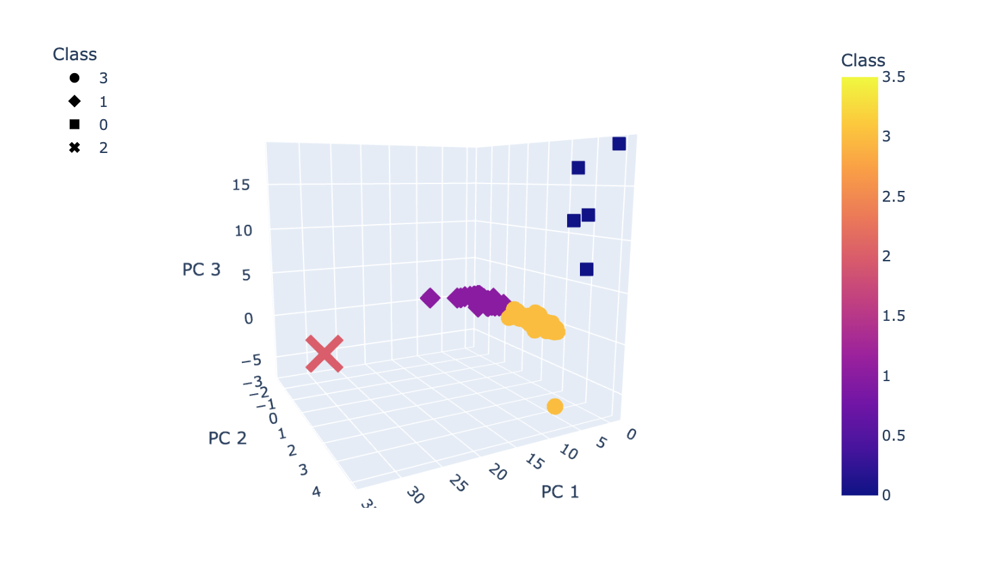
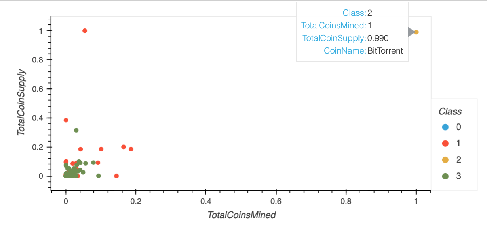

# Cryptocurrencies_MachineLearning

The goal is to create a classification model for cryptocurrencies.

Process:
1. Preprocess the data for PCA
2. Use PCA to reduce the data dimensions
3. Use a KMeans model to cluster the cryptocurrencies
4. Vizualize the results

